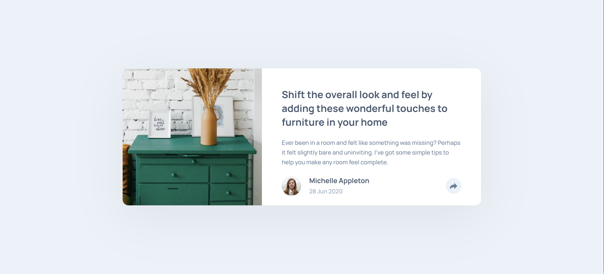
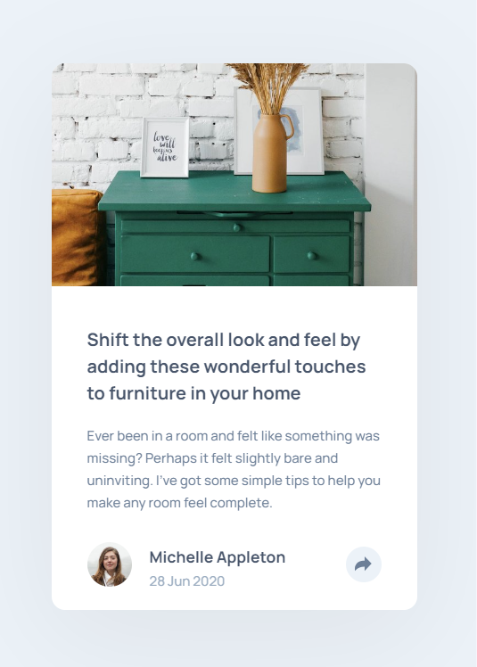

# Frontend Mentor - Article preview component

This is a solution to the [Article preview component](https://www.frontendmentor.io/learning-paths/javascript-fundamentals-oR7g6-mTZ-/steps/667ad21c983369c533731a2f/challenge/start).

## Table of contents

  - [Overview](#overview)
  - [Links](#links)
  - [My process](#my-process)
  - [Built with](#built-with)
  - [What I learned](#what-i-learned)

## Overview

### Links

- Solution URL: [Repository URL](https://github.com/msa-sitare/article-preview-component)
- Live Site URL: [Live Site URL](https://msa-sitare.github.io/article-preview-component/)

## My process

### Built with

- HTML
- CSS
- JavaScript

### What I learned

-creating small events with js
-struggled to create slide-in/slide-out animation for popup when visibility toggled.